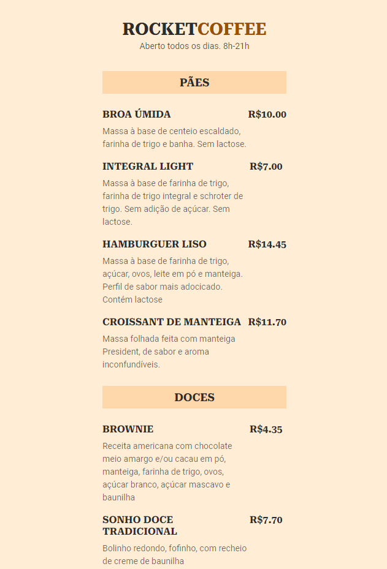

#  Maratona Explorer 3.0 

> Trilha Explorer 

Projeto construido Na maratona Explorer  da Rocketseat.

👉🏼[Clique aqui para accessar](https://jose26362780.github.io/Maratona-Explorer-3.0/)

👉🏼[Clique aqui para accessar] (https://maratona-explorer-3-0.netlify.app/)

##  🔧 Tecnologias

- Html 
- Css
- Git e Github

##  🖥️ O que aprendi Nessa edição da MARATONA EXPLORER

Foi construido um site completamente desde o zero com muita mão na massa, completamente responsivo orientado a um menu de restaurante 

Para accesar a app pelo QR CODE

## Contato 💻🧑‍💻 

juniorjose1925@gmail.com

https://www.linkedin.com/in/jose-martinez-352032222/
